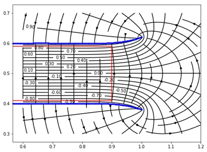

# Application for modelling and visualization of electro-magnetic fields
Bachelors diploma at Moscow Power Engineering Institute (NRU MPEI)

## Background

This work is devoted to modeling and visualization of the electric field in the capacitor based on the boundary element method using the Python ecosystem. The two-dimensional and three-dimensional axisymmetric case is considered.
These experiments are necessary to increase the area of uniform distribution of tension in the interelectrode space. Increasing the maximum area of the uniform area is achieved by changing the shape of the electrodes.
As a result, the area with minimal nonuniform tension distribution was increased by 8% for the two-dimensional case and by 6% for the axisymmetric case.
Studies of this work can be used for the design and visualization of high-voltage inputs, capacitor structures. The application, which was written to carry out all the necessary experiments can be further used for virtual laboratory work.
